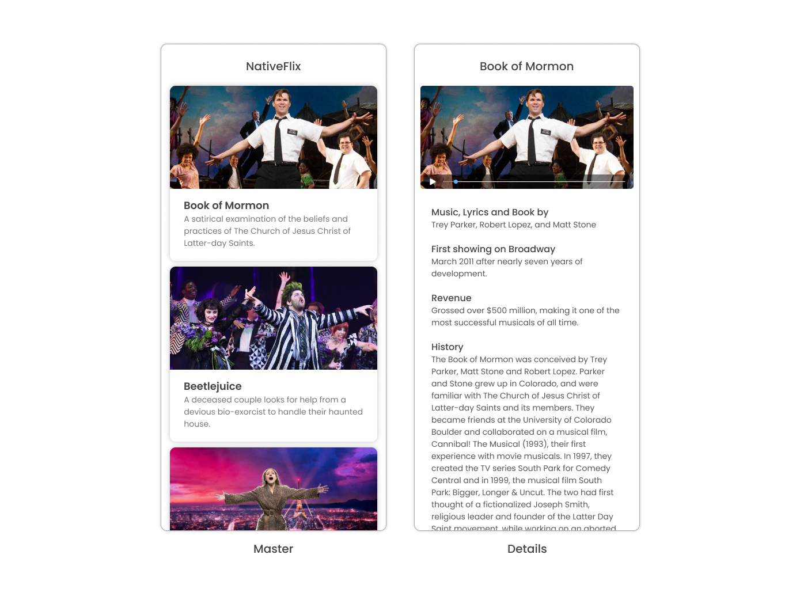

# NativeScript Svelte



## Development

This app is built with the NativeScript CLI. Once you have the [CLI installed](https://docs.nativescript.org/start/quick-setup), start by cloning the repo:

```
npm i -g nativescript
```

> For more information on how to use Svelte with NativeScript, check out the official [Svelte-Native documentation](https://svelte-native.technology/)

Clone the repo and go to the project's directory:

```bash
git clone https://github.com/NativeScript/tutorials.git

cd tutorials/svelte-tutorial
```

Install the project's dependencies:

```bash
npm install
```

You can then run the app on iOS and Android using the following commands:

```bash
ns run ios

ns run android
```
